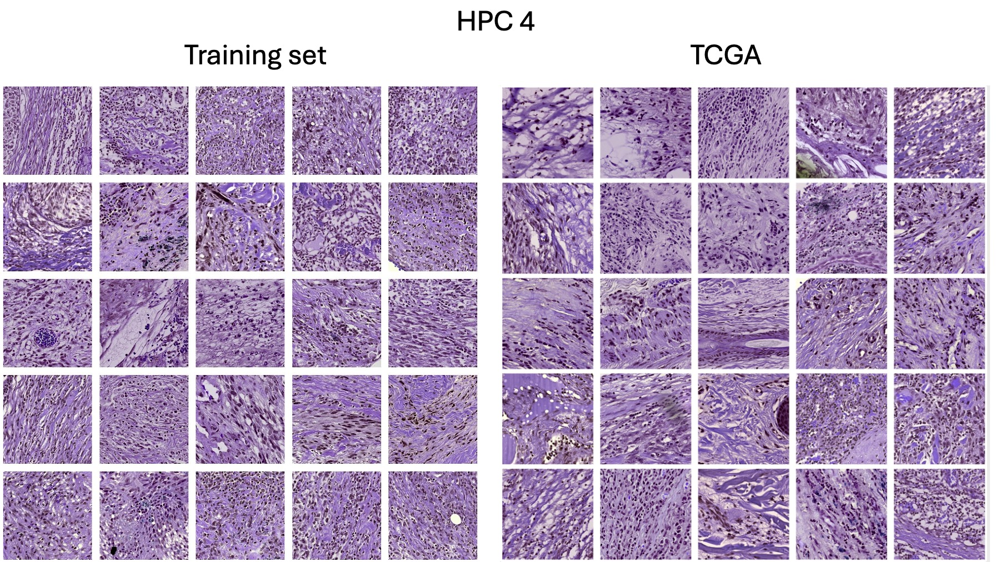
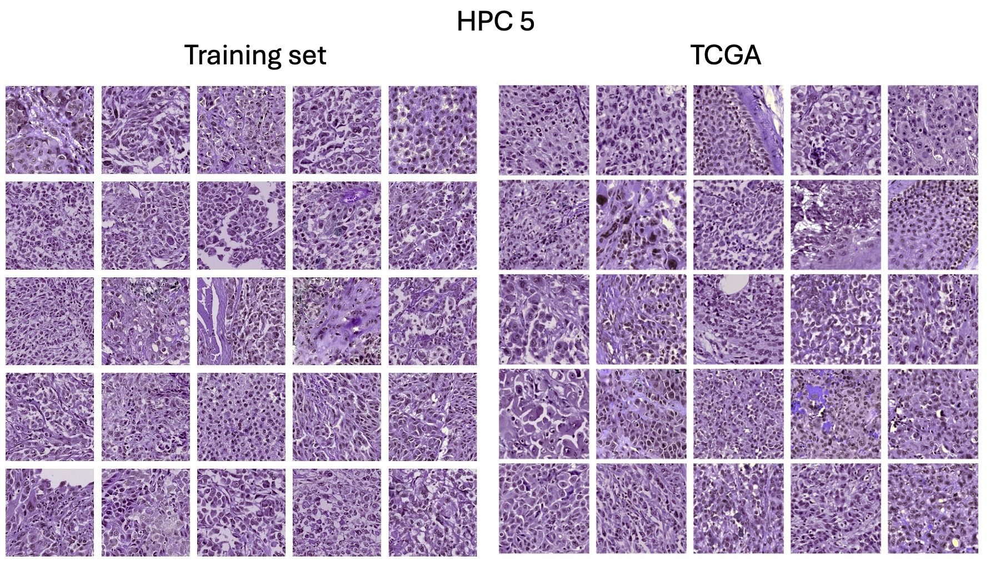
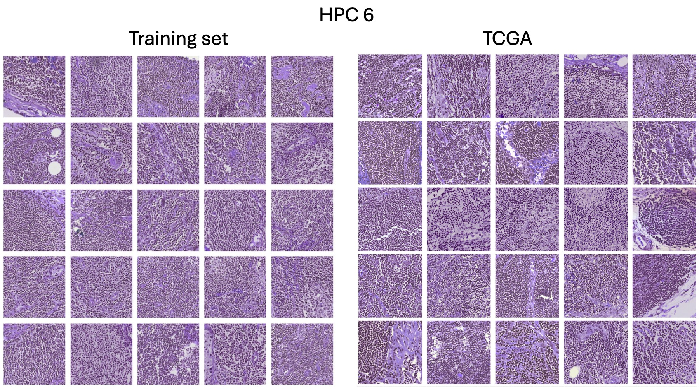
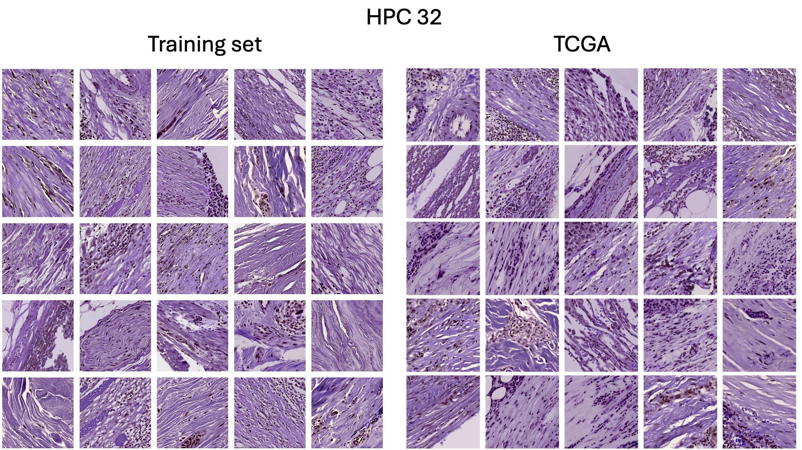
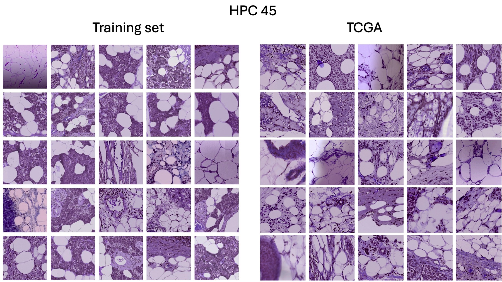
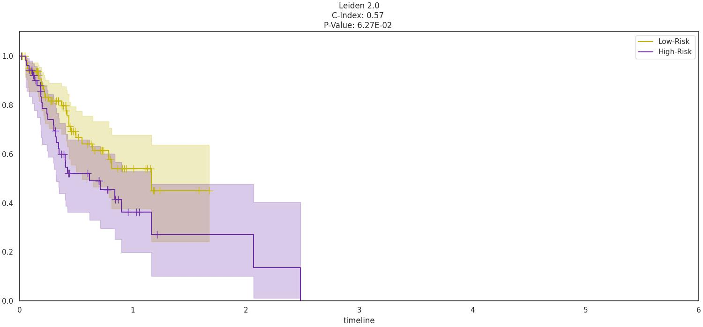
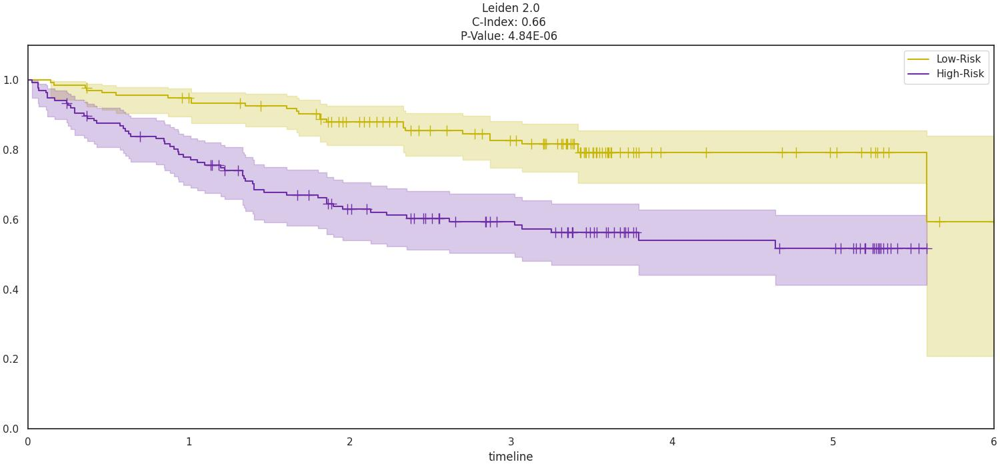
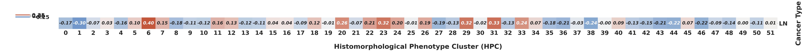
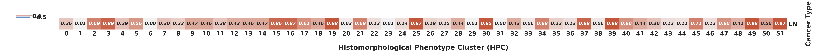
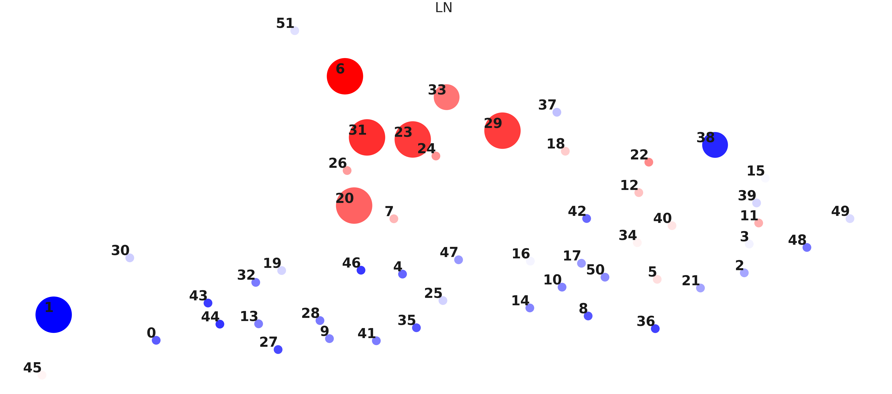

# Case study

Using a subset of the TCGA cohort, we illustrate here how you can potentially use the trained network on your own dataset and reproduce the results obtained in the manuscript. All examples are given as if runs are submitted on a slurm cluster. Before submitting any script, edit it to adjust the inputs and paths to match those on your system.

## Required packages and installation
As mentioned esrlier, to run the code you need to install [DeepPATH](https://github.com/ncoudray/DeepPATH) and [HPL](https://github.com/AdalbertoCq/Histomorphological-Phenotype-Learning). For simplicity, the required libraries have been copied here but please refer to the original github pages for installations and associated environments. 

The code here was developed using the slurm executor on NYU's [UltraViolet HPC cluster](https://med.nyu.edu/research/scientific-cores-shared-resources/high-performance-computing-core). The python script is therefore here given with slurm headers appropriate for this cluster as example so they could easily be adapted.

All additional data mentioned throughout can be downloaded from [our public repository: https://genome.med.nyu.edu/public/tsirigoslab/DeepLearning/Melanoma_Faak_etal](https://genome.med.nyu.edu/public/tsirigoslab/DeepLearning/Melanoma_Faak_etal).

## Download the checkpoints, embeddings and clusters associated with the Melanoma trained network
The checkpoints of the trained networks can be downloaded from our [public repository](https://genome.med.nyu.edu/public/tsirigoslab/DeepLearning/Melanoma_Faak_etal/). 


## Downaload the TCGA dataset
Although the TCGA cohort does not contain the treatment information and is somehow different from our training cohort, the presence of some slides from metastatic tumor could be used to check the association to HPCs. 

The data was downloaded from the [TCGA GDC website](https://portal.gdc.cancer.gov/) 


## 1. Pre-processing
You can skip these steps and directly used the pre-processed stack available in the datasets folder from our [public repository](https://genome.med.nyu.edu/public/tsirigoslab/DeepLearning/Melanoma_Faak_etal/).

### 1.a. Tile the slides
The following job will launch 1 job per slide on the cluster and save results in a folder named `896px_0um2525_B40_20250221_TCGA`.


```shell
SVSPATH="/path_to/diagnostic_SKCM_svs/*/"

for f in `ls ${SVSPATH}/*svs`
do
 f2=${f##*/}
 f3=${f2%.*}
 echo $f3
 ls  ${SVSPATH}/${f2}

  sbatch --job-name=Melanoma_Tile_TCGA_${f3}  --output=rq_IO_TCGA_896_40x_${f3}_%A.out --error=rq_IO_TCGA_896_40x_${f3}_%A.err  sb_00a_base_tile.sh  -s 896  -e 0 -j 20 -B 40  -D 16  -o "896px_0um2525_B40_20250221_TCGA" -M -1 -P 0.2525 -p -1  -N '57,22,-8,20,10,5' ${SVSPATH}"/"${f3}"*svs"

  sleep 0.1

done
```

### 1.b. Sort the tiles
We wanted to restrain our study to only Metastatic tumors within the TCGA database. The list of selected case is saved in the `selected_TCGA.txt` file. This script needs to be run in a new empty folder.

```shell
mkdir sort_tiles
cd sort_tiles
sbatch ../sb_00b_sort.sh
```

You will end up with a new subfolder where the tiles from the selected slides will be symlink'ed.

### 1.c. Convertion to h5
Finally, those tiles will be saved in a h5 file, needed as an input to the HPL pipeline. 

```shell
sbatch sb_00c_h5_tr.sh
```

You should see 3 h5 files named `hdf5_comb005_TCGA_40x_896px_he_train.h5`, `hdf5_comb005_TCGA_40x_896px_he_test.h5` and `hdf5_comb005_TCGA_40x_896px_he_validation.h5`. 

You can potentially use the 3 h5 obtained to retrain Barlow-Twins based section from scratch, but in this case study, we will project it on the space of the network trained on our internal cohort, merge them, and use them as external validation cohort. Training and clustering steps will therefore be skipped. However, tiled jpg are needed for the step 5b. 

## 2. Projection
Project each h5 file into the already trained latent space. 

```shell
sbatch sb_02_project.sh
```

When done, you should see 3 h5 files saved in a sub-directory named `results/BarlowTwins_3_twentyE/comb005_TCGA_40x_896px/h224_w224_n3_zdim128/`.

## 3. Merge output files
Since we will use them as an external validation, those 4 h5 files will be merged as one:

```shell
sbatch sb_03_combine.sh
```

Inside the same output path, you should see a new file named `hdf5_comb005_TCGA_40x_896px_he_complete.h5`.

## 4. Add header
You can information in the header, for example, the survival information which will be used during the regression. The format for the input text file containing the labels (`labels_TCGA_unique.txt`) is available from this github page. 

```shell
sbatch sb_04_AddField.sh
```

In the same output directory as before, you should see a new h5 file named `hdf5_comb005_TCGA_40x_896px_he_complete_OS.h5`.

## 5. Assign Leiden cluster
Assuming you have downloaded the result folder from our [public repository](https://genome.med.nyu.edu/public/tsirigoslab/DeepLearning/Melanoma_Faak_etal/), you can now copy (or synmlink) the `hdf5_comb005_TCGA_40x_896px_he_complete_OS.h5`  into the `results/BarlowTwins_3_twentyE/comb005_5setsNoNYU_40x_896px/h224_w224_n3_zdim128/` path. Then, you can assign HPCs to the TCGA tiles using the already trained dataset, and using the same resolution as the one used in the manuscript.

```shell
for resolution in 
2.0; do sbatch --job-name=TCGA_05_r${resolution} --output=log_TCGA_05_r${resolution}_%A_%a.out  --error=log_TCGA_05_r${resolution}_%A_%a.err sb_05b_AssignCluster.sh $resolution; done
```

In the `comb005_v01/adatas` subdirectory of this new path, you should see new `csv` files listing, for each tile, which HPC it is associated with. 


## 6. Check cluster assignment
This is the visual control that your tiles have been associated with the proper HPC. To generate random tiles from your external dataset, you can use Bojing Liu's code (developed in Liu, Polack et al. 2025, Nat. Comm) copied in this github page (`06_BLiu_HPC_Tiles.ipynb`). You can open and run it via a jupyter notebook. For each HPC, it will select random tiles from your external cohort.They should be enriches in features associated with the HPC (see manuscript), and look like tiles randomy selected from the train and test cohort published (see manuscript or detailed images for each HPC in our public repository ([tiles_leiden_2p0_fold3.zip](https://genome.med.nyu.edu/public/tsirigoslab/DeepLearning/Melanoma_Faak_etal/tiles_leiden_2p0_fold3.zip)).

A few examples below showing tiles randonly selected from the train set (left) and from the TCGA cohort (right) from a few HPCs.

<!--





--!>

 


Note: Because of the libraries used for now, the tiles are displayed with BGR instead of RGB convention. 


## 7. Overall Cox regression
In your output `result` folder (at the same level whee the h5 files are saved), create new subfolders for the subsequent outputs. For example, we named ours `comb005_v01_OS_001_ff3`, `comb005_v01_OS_002_ff3`, `comb005_v01_OS_003_ff3` and `comb005_v01_OS_004_ff3` to store results for Cox regression using training done on the whole training dataset (1), only the subset of patients treated with anti-CTLA4 (2), anti-PD1 (3), or with a combo of both (4). Since the same leiden clusters are used throughout the study, copy (or symlink) the adatas folder from `comb005_v01` into each of those 4 folders. 

Although the TCGA cohort is different from our training set, not optimal and the treatments unknown, it will give users a good sense on how to apply the pipeline. Furthermore, the training graphs you should see should match those in the papers (except the 001 experiment which was not relevant to the study). 

```shell
sbatch sb_08_CoxReg.sh
```

As before, modify the code above according to your system. Note, in the script, you will need to adjust the value of option `Opt` from 1 to 4 depending on which Cox Regression you want to achieve (full dataset independent of the treatment, or treatment specific)


## 8. Cox regression plots for fold 3 of each treatment
To get the KM plot for the training set and the TCGA dataset, the following script can be used:

```shell
sbatch sb_09_CoxReg_Indiv.sh
```
As before, modify the `Opt` option accordingly. 

For `Opt 1` (survival regardless of the treatment, you would expect these results:


<div style="display: flex; justify-content: space-between;">

    
    

</div>
<div style="text-align: center;">
  <p><strong>Sine Wave</strong></p>
</div>

<div style="text-align: center;">
  <p><strong>Cosine Wave</strong></p>
</div>


|Cross-validation on the training set             |  TCGA cohort |
|-------------------------|-------------------------|
| |  |


Although it is not known whether the patients from the TCGA cohorts had anti-PD-1 treatment, projecting it on the anti-PD-1 regression shown in the manuscript would result in the curve below:


Cross-validation on the training set             |  TCGA cohort
:-------------------------:|:-------------------------:
{:width="300px"} | {:width="300px"} 

## 9. Example of additional tests

If your dataset contains extra information from orthogonal methods, you can analyse HPC enriched in tiles associated with specific features. For example, we retrieved the Tumor-Mutational Burden (TMB, file `labels_TCGA_TMB_unique.csv` attached) for that TCGA cohort and using a Spearman correlation, checked HPCs enriched in slides from patients with low/high TMB. The `TCGA_SKC_TMB.ipynb` code can be run via a jupyter notebook.


From it, you would obtain the Spearman Correlation between the TMB and the HPCs:

 

the p-values associated:

 

and a those information plotted on the same PAGA graph as those shown in the manuscript:

 


